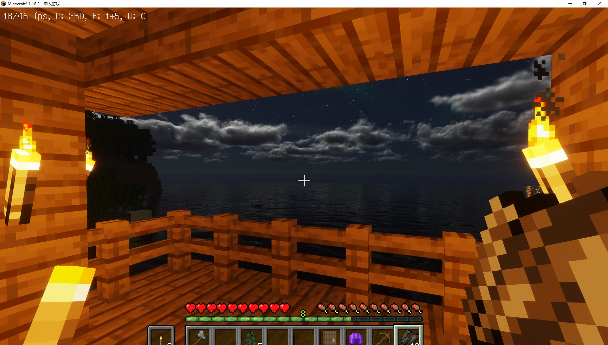
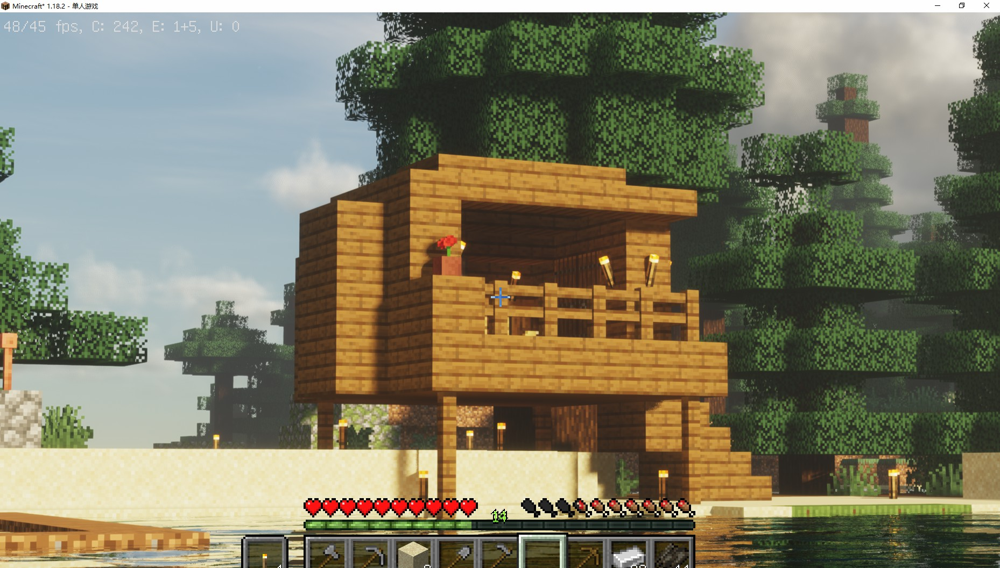

# 20220430 to now

## 2022.4.30
我创建了一个新世界，版本为1.18.2，名字叫HelloWorld。  

## 2022.5.2
在出生点附近修小别墅（悬空火柴盒），还没修完。出生点旁边就有峡谷，真不戳。  
探索了一下这个峡谷，原来这个峡谷这么小，也没什么东西。  

## 2022.5.3
矿道挖到基岩层了。  
找到了两个村庄，第一个很小，3座房子，一个箱子也没有；第二个村庄蛮大的，资源也多。  
往家里运了2头牛2只羊，田也修大了一些。  
下次去大修村庄2。  

## 2022.5.4
扩建了牧场。  
原来敲钟就能让村民直接回床，以前都傻傻地等天黑。总而言之村民已经被我集中关起来了，好！  
建筑师10粘土球换1绿宝石，1绿宝石换10砖头，之前居然一直用煤烧粘土球，煤都烧完了，亏死。  

